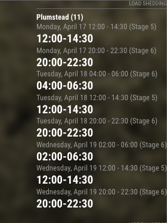

# Module: MMM-LoadShedding

## Screenshot

## Installation

1. Navigate to the `MagicMirror/modules` directory.
2. Execute `git clone https://github.com/qunu/MMM-LoadShedding.git`
3. Configure the module as per below
4. Restart MagicMirror

For configuration options, please check the [MagicMirror² documentation](https://docs.magicmirror.builders/modules/configuration.html).

API Access:

Register -> https://eskomsepush.gumroad.com/l/api

API Docs -> https://documenter.getpostman.com/view/1296288/UzQuNk3E

## You will need to replace id param in URL for your area :
https://developer.sepush.co.za/business/2.0/area?id=capetown-11-plumstead
